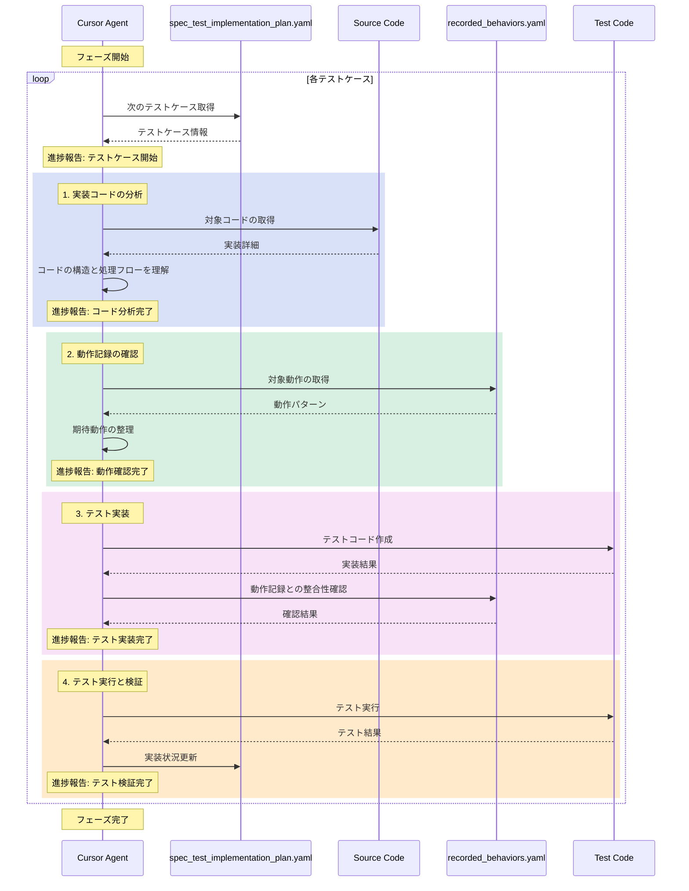

## SpecStory

## テスト実装ワークフローの反省と改善提案 (2025/2/17 23:45:20)

_**User**_

 @exp3/テスト実装ワークフローの実行 は、  @WORKFLOW_SPEC_TEST_IMPLEMENTATION.md テスト実装ループフェーズをCursorエージェントに実行させた結果です。結果的にうまく実装はできたものの、一部やり取りがうまくいかなかったり、スムーズさに欠けた部分があったかと思います。反省点を列挙してみて。

---

_**Assistant**_

# テスト実装ワークフロー実行の振り返り分析

## 1. 課題点の分析

### コミュニケーション面での課題
1. **動作記録の参照が不十分**
   - recorded_behaviors.yamlの内容を十分に確認せずに実装を進めてしまった場面があった
   - 動作の詳細について、より明示的な確認が必要だった

2. **実装ステップの可視化不足**
   - 現在どのステップを実行しているのか、次は何をするのかの説明が不足
   - ワークフローの進捗状況の報告が不規則

### 技術面での課題
1. **依存関係の扱い**
   - テストケース間の依存関係の分析が不十分
   - 実行順序の最適化について十分な検討がされていなかった

2. **テストデータの準備**
   - テストデータのセットアップ方法の説明が不足
   - シーダーやマイグレーションの使用方針が明確でなかった

## 2. 改善提案

### プロセスの改善
1. **進捗報告の標準化**
```markdown
## 現在の実装状況
- 実行中のフェーズ: [フェーズ名]
- 完了したステップ: [具体的な内容]
- 次のステップ: [予定の作業]
- 検出された課題: [存在する場合]
```

2. **動作記録の確認プロセス**
```yaml
verification_steps:
  - step: 動作パターンの確認
    items:
      - 入力値の検証
      - 期待される結果の確認
      - エッジケースの特定
  - step: 実装との整合性確認
    items:
      - コントローラーの処理フロー
      - データベース操作
      - レスポンス形式
```

### 実装アプローチの改善
1. **テストケース実装の構造化**
```php
/**
 * @source recorded_behaviors.yaml#behavior_id
 * @depends test_name_if_applicable
 */
public function testSpecificBehavior()
{
    // 1. テストデータのセットアップ
    // 2. 動作の実行
    // 3. 結果の検証
    // 4. クリーンアップ
}
```

## 3. 今後の実装時の注意点

1. **計画フェーズの強化**
   - 実装前の動作記録の完全な理解
   - 依存関係の明確な図式化
   - テストデータ準備の詳細計画

2. **コミュニケーションの改善**
   - 各ステップでの明確な進捗報告
   - 課題発生時の早期報告
   - 実装決定の根拠の明示

3. **品質管理の強化**
   - 動作記録との整合性チェックの徹底
   - テストカバレッジの確認
   - エッジケースの網羅的検証

## 4. まとめ

今回の実装経験から、以下の点を重点的に改善する必要があります：

1. **プロセスの透明性**
   - 実装手順の明確な提示
   - 進捗状況の定期的な報告
   - 決定事項の根拠の明示

2. **品質管理の徹底**
   - 動作記録との厳密な整合性確認
   - テストケース間の依存関係の管理
   - エラーケースの包括的な検証

3. **ドキュメンテーションの充実**
   - テストケースの意図の明確な記述
   - 実装の前提条件の明示
   - 参照している動作記録の明確な記載

これらの改善点を意識することで、より効率的で質の高いテスト実装が可能になると考えられます。

---

_**User**_

動作記録の参照が不十分なのに加えて、実装内容の確認が不十分なことがあるよね。基本のループ時はいいけど、エラーが起こった時に混乱しがち。エラー発生時はエラー内容確認→動作記録のどこ部分がエラー対象なのか確認→対象の実装コード確認→動作記録・実装コードどちらとも整合性が取れるようにテストコードを編集するという流れが欲しいね。

実装ステップの可視化不足も問題だね。

あと、せっかくシーケンス図で処理の順番をわかりやすくしてるのだから、それに沿ってエージェントは動いて欲しいよね。

これら3つの問題点が再発しないように @WORKFLOW_SPEC_TEST_IMPLEMENTATION.md のテスト実装ループフェーズを編集しましょう。

---

_**Assistant**_

はい、ご指摘の3つの問題点を改善するため、テスト実装ループフェーズの編集を行います。

````markdown:WORKFLOW_SPEC_TEST/FLOW/WORKFLOW_SPEC_TEST_IMPLEMENTATION.md
## 2. テスト実装ループフェーズ

### 実装ループの基本構造
各テストケースの実装は、以下のシーケンス図に厳密に従って進行します：



### 進捗報告フォーマット
各ステップ完了時に必ず以下のフォーマットで報告を行います：

```markdown
## 進捗報告
現在のテストケース: [テストケース名]
完了したステップ: [ステップ名]
次のステップ: [次のステップ名]
状態: [正常 or エラー]
```

### エラー発生時の対応フロー
エラーが発生した場合、以下の手順で対応します：

1. **エラー状況の把握**
```markdown
## エラー報告
発生箇所: [ステップ名]
エラー内容: [具体的な内容]
対象テストケース: [テストケース名]
```

2. **動作記録の確認**
```markdown
## 動作記録確認
対象動作ID: [ID]
該当箇所: [具体的な記述]
期待される動作: [動作の詳細]
```

3. **実装コードの確認**
```markdown
## 実装コード確認
対象ファイル: [ファイルパス]
関連メソッド: [メソッド名]
処理内容: [具体的な処理]
```

4. **解決策の実施**
```markdown
## 解決策実施
修正方針: [具体的な方針]
修正内容: [変更点の詳細]
整合性確認:
  - 動作記録との整合性: [確認結果]
  - 実装コードとの整合性: [確認結果]
```

### テストケース実装の詳細手順

1. **実装コードの分析**
   ```markdown
   ## コード分析レポート
   対象コンポーネント: [コンポーネント名]
   主要な処理フロー:
     1. [処理ステップ1]
     2. [処理ステップ2]
     ...
   依存関係:
     - [依存コンポーネント1]
     - [依存コンポーネント2]
   ```

2. **動作記録の確認**
   ```markdown
   ## 動作記録分析
   対象動作: [動作ID]
   入力データ:
     - [入力項目1]:

---


---

