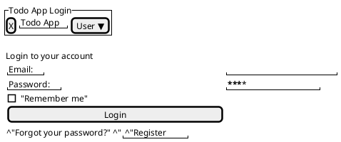

# ログイン画面定義書

## 画面概要
- 画面名: ログイン画面
- URL: /login
- 役割: ユーザー認証のためのログインフォームを提供

## 画面レイアウト
### ヘッダー部分
- アプリケーションロゴ
- アプリケーション名

### メインコンテンツ
#### ログインフォーム
- メールアドレス入力フィールド（必須）
  - タイプ: email
  - バリデーション: メールアドレス形式
  - プレースホルダー: 「メールアドレスを入力してください」
  
- パスワード入力フィールド（必須）
  - タイプ: password
  - バリデーション: 8文字以上
  - プレースホルダー: 「パスワードを入力してください」

- Remember Me チェックボックス
  - タイプ: checkbox
  - デフォルト: 未チェック

- ログインボタン
  - タイプ: submit
  - スタイル: プライマリーカラー

### フッター部分
- パスワードリセットリンク
  - テキスト: 「パスワードをお忘れの方」
  - リンク先: /password/reset
  
- アカウント登録リンク
  - テキスト: 「新規登録はこちら」
  - リンク先: /register

## スタイリング
- フレームワーク: Tailwind CSS
- レスポンシブ対応
  - モバイル（〜767px）
  - タブレット（768px〜1023px）
  - デスクトップ（1024px〜）

## エラー表示
- バリデーションエラー
  - 入力フィールド下部に赤文字でエラーメッセージを表示
  - フィールドの枠線を赤色に変更

- 認証エラー
  - フォーム上部にエラーメッセージを表示
  - メッセージ: 「メールアドレスまたはパスワードが正しくありません」

## セキュリティ対策
- CSRF対策
  - CSRFトークンの自動埋め込み
- ブルートフォース対策
  - 試行回数制限の実装
- パスワードの安全な取り扱い
  - 平文での送信防止（HTTPS）

## アクセシビリティ
- WAI-ARIA対応
- キーボード操作対応
- スクリーンリーダー対応

## 画面遷移
- ログイン成功時: ダッシュボード画面（/dashboard）へ遷移
- ログイン失敗時: 同画面にエラーメッセージを表示
- パスワードリセット: パスワードリセット画面へ遷移
- 新規登録: ユーザー登録画面へ遷移

## UI図
