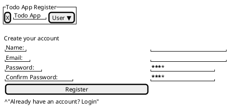

# ユーザー登録画面定義書

## 画面概要
- 画面名: ユーザー登録画面
- URL: /register
- 役割: 新規ユーザーの登録フォームを提供

## 画面レイアウト
### ヘッダー部分
- アプリケーションロゴ
- アプリケーション名

### メインコンテンツ
#### 登録フォーム
- 名前入力フィールド（必須）
  - タイプ: text
  - バリデーション: 2文字以上
  - プレースホルダー: 「名前を入力してください」

- メールアドレス入力フィールド（必須）
  - タイプ: email
  - バリデーション: メールアドレス形式、一意性チェック
  - プレースホルダー: 「メールアドレスを入力してください」

- パスワード入力フィールド（必須）
  - タイプ: password
  - バリデーション: 8文字以上
  - プレースホルダー: 「パスワードを入力してください」

- パスワード確認フィールド（必須）
  - タイプ: password
  - バリデーション: パスワードと一致
  - プレースホルダー: 「パスワードを再入力してください」

- 登録ボタン
  - タイプ: submit
  - スタイル: プライマリーカラー

### フッター部分
- ログインページリンク
  - テキスト: 「すでにアカウントをお持ちの方」
  - リンク先: /login

## スタイリング
- フレームワーク: Tailwind CSS
- レスポンシブ対応
  - モバイル（〜767px）
  - タブレット（768px〜1023px）
  - デスクトップ（1024px〜）

## エラー表示
- バリデーションエラー
  - 入力フィールド下部に赤文字でエラーメッセージを表示
  - フィールドの枠線を赤色に変更
  - エラーメッセージ例:
    - 「名前は必須です」
    - 「有効なメールアドレスを入力してください」
    - 「このメールアドレスは既に使用されています」
    - 「パスワードは8文字以上である必要があります」
    - 「パスワードが一致しません」

## セキュリティ対策
- CSRF対策
  - CSRFトークンの自動埋め込み
- パスワードの安全な取り扱い
  - 平文での送信防止（HTTPS）
  - パスワードのハッシュ化
- メール確認機能
  - 登録後の確認メール送信

## アクセシビリティ
- WAI-ARIA対応
- キーボード操作対応
- スクリーンリーダー対応
- 必須項目の明確な表示

## 画面遷移
- 登録成功時: 
  - メール確認画面へ遷移
  - 確認メールの送信
- 登録失敗時: 
  - 同画面にエラーメッセージを表示
  - 入力値の保持（パスワードを除く）
- ログインページリンク: 
  - ログイン画面へ遷移

## UI図
