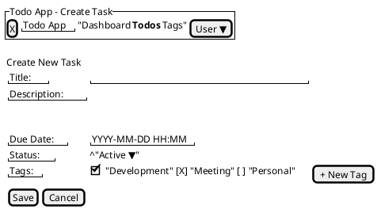

# ToDo作成画面定義書

## 画面概要
- 画面名: ToDo作成画面
- URL: /todos/create
- 役割: 新規ToDoタスクの作成フォームを提供

## 画面レイアウト
### ヘッダー部分
- アプリケーションロゴ
- ナビゲーションメニュー
  - ダッシュボード
  - ToDo一覧
  - タグ管理
- ユーザー情報
  - ユーザー名
  - ログアウトボタン

### メインコンテンツ
#### タスク作成フォーム
- タイトル入力フィールド（必須）
  - タイプ: text
  - バリデーション: 必須、最大100文字
  - プレースホルダー: 「タスクのタイトルを入力してください」

- 説明入力フィールド
  - タイプ: textarea
  - バリデーション: 最大500文字
  - プレースホルダー: 「タスクの詳細を入力してください」
  - リサイズ可能

- 期限設定
  - タイプ: datetime-local
  - デフォルト: なし
  - バリデーション: 現在時刻以降

- ステータス選択
  - タイプ: select
  - オプション:
    - 未完了（デフォルト）
    - 完了
    - 保留中

- タグ選択
  - タイプ: multiselect
  - 既存タグから選択可能
  - 新規タグ作成可能
  - カラーピッカー（新規タグ作成時）

#### アクションボタン
- 作成ボタン
  - タイプ: submit
  - スタイル: プライマリーカラー
  - テキスト: 「タスクを作成」

- キャンセルボタン
  - タイプ: button
  - スタイル: セカンダリーカラー
  - テキスト: 「キャンセル」

## スタイリング
- フレームワーク: Tailwind CSS
- レスポンシブ対応
  - モバイル（〜767px）
    - 1列レイアウト
    - フルワイドフォーム
  - タブレット（768px〜1023px）
    - 2カラムレイアウト
  - デスクトップ（1024px〜）
    - 2カラムレイアウト
    - 最大幅設定

## バリデーション
### フロントエンド
- リアルタイムバリデーション
  - 入力中のフィードバック
  - エラーメッセージのインライン表示
- 送信前の全項目チェック

### バックエンド
- 必須項目チェック
- 文字数制限チェック
- 日時の妥当性チェック
- 重複チェック

## エラー表示
- フィールド単位のエラー
  - 入力フィールド下部に赤文字で表示
  - フィールドの枠線を赤色に変更
- フォーム全体のエラー
  - フォーム上部にエラーメッセージを表示
  - エラー項目へのスクロール

## セキュリティ対策
- CSRF対策
  - CSRFトークンの自動埋め込み
- XSS対策
  - 入力値のエスケープ処理
- 認可チェック
  - ログインユーザーのみアクセス可能

## アクセシビリティ
- WAI-ARIA対応
- キーボード操作対応
- スクリーンリーダー対応
- 必須項目の明確な表示
- エラーメッセージの適切な関連付け

## 画面遷移
- 作成成功時
  - ToDo一覧画面へ遷移
  - 成功メッセージをフラッシュ表示
- 作成失敗時
  - 同画面に留まる
  - エラーメッセージを表示
  - 入力値を保持
- キャンセル時
  - ToDo一覧画面へ遷移
  - 確認ダイアログを表示（入力値がある場合）

## 機能拡張
- ドラフト保存機能
- テンプレート機能
- 添付ファイル機能
- リマインダー設定
- 優先度設定
- 繰り返し設定

## UI図
